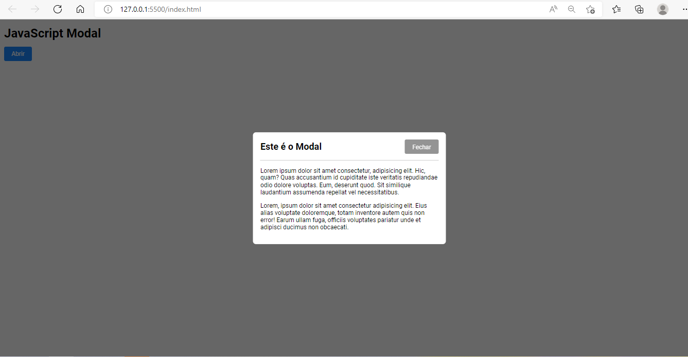
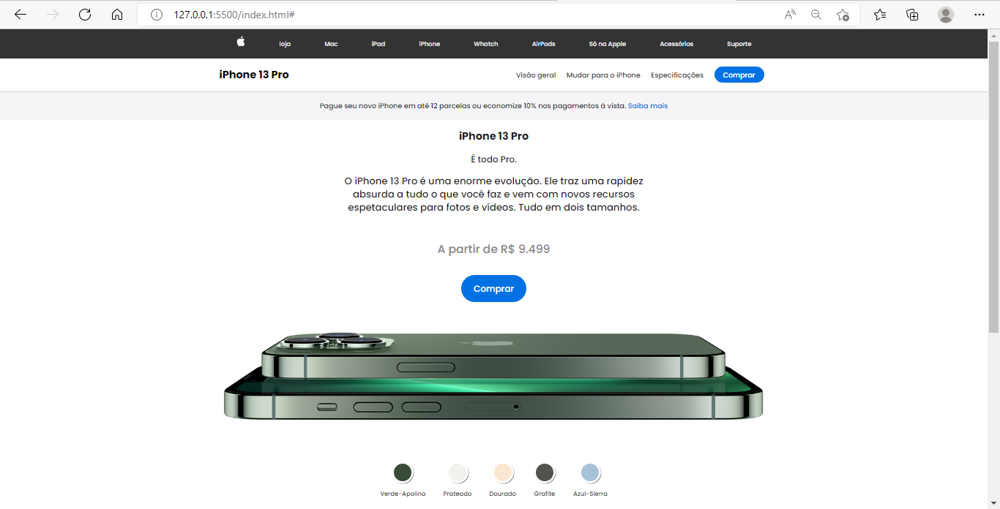

# cursos-hora de codar
## Desenvolvimento de um Modal

### Referência do Projeto Original
- Professor Matheus Battist - https://www.youtube.com/watch?v=kj6GFACwLYo
- link - https://fonts.google.com/about
- Fonte de Consulta - https://developer.mozilla.org/pt-BR/docs/Web

 Desenvolvimento com o objetivo de fixar o conhecimento das tecnologias HTML, CSS e JavaScript, toda documentação está com os comentários.
 
 ## Modal
 
 
 ## iPhone Pro 13
 
 
 ## Estrutura do Curso
 ## 
